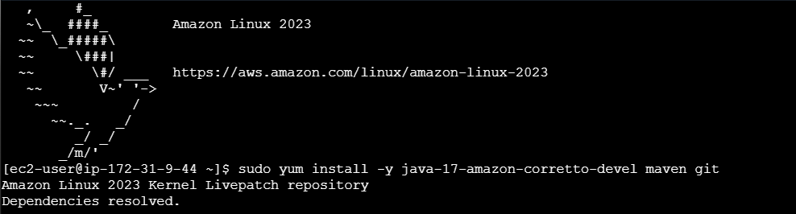
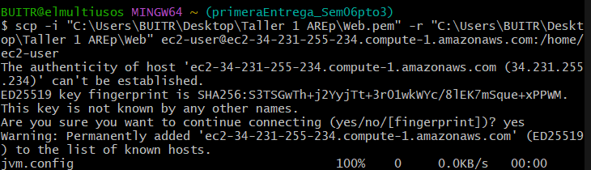
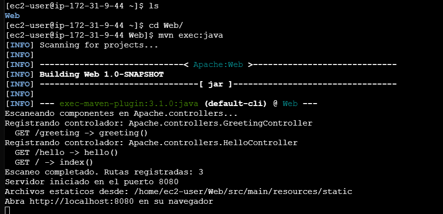

# Taller de Arquitecturas de Servidores de Aplicaciones, Meta protocolos de objetos, Patrón IoC, Reflexión

Servidor Web tipo Apache construido en Java puro (sin frameworks externos). Incluye un framework IoC (**MicroSpringBoot**) que usa reflexión para descubrir controladores anotados y mapear endpoints HTTP automáticamente.

## Descripción

El proyecto implementa:

- **Servidor HTTP** capaz de entregar páginas HTML e imágenes PNG.
- **Framework IoC** que escanea el classpath y registra POJOs anotados con `@RestController`.
- **Soporte de anotaciones**: `@GetMapping` para mapear rutas y `@RequestParam` para inyectar parámetros de consulta.
- Atención de múltiples solicitudes no concurrentes.

## Arquitectura

```
Apache/
├── App.java                     # Punto de entrada del servidor
├── annotations/
│   ├── RestController.java      # Marca una clase como controlador
│   ├── GetMapping.java          # Mapea un método a una ruta GET
│   └── RequestParam.java        # Inyecta parámetros de query string
├── controllers/
│   ├── HelloController.java     # Controlador de ejemplo básico
│   └── GreetingController.java  # Controlador con @RequestParam
├── server/
│   ├── SimpleWebServer.java     # Servidor HTTP (archivos estáticos + dinámicos)
│   └── MicroSpringBoot.java     # Framework IoC con reflexión de Java
└── util/
    └── ImageGenerator.java      # Genera imagen PNG de prueba
```

### Flujo de funcionamiento

1. `App.java` inicia el framework `MicroSpringBoot`.
2. El framework escanea el paquete `Apache.controllers` buscando clases con `@RestController`.
3. Para cada clase encontrada, registra los métodos anotados con `@GetMapping` en un mapa de rutas.
4. `SimpleWebServer` escucha en el puerto 8080 y por cada petición:
   - Consulta al framework si existe un handler registrado para la ruta.
   - Si existe, invoca el método vía reflexión (resolviendo `@RequestParam`).
   - Si no existe, intenta servir un archivo estático desde `src/main/resources/static/`.

## Prerrequisitos

- Java 17+
- Maven 3.8+

## Compilación y ejecución

```bash
# Compilar
mvn clean compile

# Ejecutar (escaneo automático de controladores)
mvn exec:java

# Ejecutar con controlador específico desde línea de comandos
java -cp target/classes Apache.App Apache.controllers.GreetingController
```

El servidor se inicia en **http://localhost:8080**.

## Endpoints disponibles

| Ruta                      | Descripción                                |
| ------------------------- | ------------------------------------------ |
| `GET /`                   | Saludo básico desde `HelloController`      |
| `GET /hello`              | Página HTML con enlaces de ejemplo         |
| `GET /greeting`           | Saludo con parámetro por defecto ("World") |
| `GET /greeting?name=Juan` | Saludo con `@RequestParam` personalizado   |
| `GET /index.html`         | Página estática HTML                       |
| `GET /img/test.png`       | Imagen PNG servida como archivo estático   |

## Ejemplo de controlador

```java
@RestController
public class GreetingController {

    @GetMapping("/greeting")
    public String greeting(@RequestParam(value = "name", defaultValue = "World") String name) {
        return "Hola " + name;
    }
}
```

## Tests

```bash
mvn test
```

Se incluyen 7 pruebas unitarias que validan:

- Registro correcto de rutas
- Respuestas de `HelloController` y `GreetingController`
- Resolución de `@RequestParam` con valor personalizado y por defecto
- Rutas inexistentes retornan `null`
- Carga de controlador por nombre de clase (FQCN)

## AWS

1.  Creamos la EC2, ingresamos e instalamos java y Maven



2.  Subimos el proyecto a la EC2



3.  Ejecutamos



## Tecnologías

- Java 17
- Maven
- JUnit 5
- `java.net.ServerSocket` (servidor HTTP)
- `java.lang.reflect` (reflexión para IoC)

## Licencia

Este proyecto fue desarrollado como taller académico para el curso de Arquitecturas Empresariales (AREP) - Escuela Colombiana de Ingeniería Julio Garavito.

## Autor

Juan Sebastian Buitrago Piñeros
